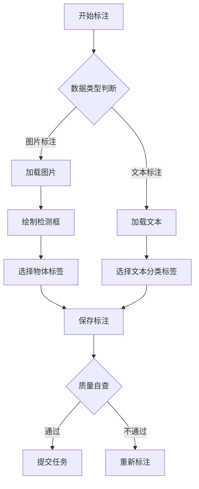

# **多模态图文标注项目标注规范文档**

## **1. 项目概述**
### 1.1 目标
本规范旨在标准化**图片+文本多模态数据**的标注流程，确保标注结果满足以下需求：
- 图片目标检测标注（矩形框标注）
- 文本分类与描述标注
- 多模态数据关联性验证

### 1.2 适用范围
- 标注工具：Label Studio v1.13.1
- 数据类型：包含图片文件及其关联文本描述的CSV文件
- 标注内容：物体检测框、文本分类标签

## **2. 操作流程**
### 2.1 标注前准备
| 步骤 | 操作说明 | 注意事项 |
|------|---------|----------|
| **1. 环境配置** | <ul><li>安装Chrome/Firefox浏览器</li><li>确保网络可访问Label Studio服务</li></ul> | 禁用IE浏览器 |
| **2. 账号登录** | <ul><li>通过项目管理员分配账号</li><li>首次登录需修改密码</li></ul> | 禁止共享账号 |
| **3. 任务领取** | <ul><li>在"任务池"中选择待标注任务</li><li>单次领取任务不超过20条</li></ul> | 超时未完成自动回收 |

### 2.2 标注操作流程


#### **详细步骤说明：**
1. **多模态数据加载**  
   - 同时显示图片和关联文本
   - 若图片加载失败：点击"刷新"按钮，3次失败后标记为异常数据

2. **图片标注要求**  
   - 物体检测框必须**完全包裹目标物体**
   - 对模糊/遮挡物体标注需添加`uncertain`标签
   - 修正预标注的边界框（拖拽调整位置）
   - 新增模型未识别的实体区域
   - 对同一图片分配3人标注
   - 遮挡超过50%不标注
   - 定期使用Pandas分析标注一致性


3. **文本标注要求**  
#### 分类标签体系
```python
# 分类标签层级结构
{
  "场景类别": ["室内", "户外", "交通工具"],
  "情感倾向": ["积极", "中性", "消极"],
  "实体类型": ["人物", "动物", "物品"]
}
```

#### 多选规则
- 主分类必选（如场景类别）
- 辅助分类最多选1项
- 冲突处理：  
  ✅ 同时选择"户外"和"动物"  
  ❌ 同时选择"室内"和"户外"

---

## **4. 质量管控体系**
### 4.1 三级检查机制
| 检查层级 | 执行角色 | 检查比例 | 通过标准 |
|---------|---------|---------|---------|
| 初级检查 | 标注员自查 | 100% | 符合基础标注规则 |
| 二级审核 | 质检员 | 30% | 错误率<5% |
| 终级验收 | 项目经理 | 10% | 错误率<2% |

### 4.2 错误等级定义
| 错误等级 | 定义                | 处理方式 |
|---------|---------------------|---------|
| 致命错误 | 漏标主要物体/错误分类 | 整批任务返工 |
| 严重错误 | 标注框偏移>10%       | 单任务重新标注 |
| 一般错误 | 标签拼写错误          | 直接修正 |

### 4.3 质量评估指标
```python
# 计算公式
标注准确率 = (正确标注数 - 修正次数) / 总标注数 * 100%
人员KPI = 准确率 * 0.6 + 日均标注量 * 0.4
```

---

## **5. 异常处理流程**
### 5.1 常见问题解决方案
| 问题现象 | 可能原因         | 解决方案 |
|---------|-----------------|---------|
| 图文内容不符 | 数据关联错误 | 标记为"data_mismatch" |
| 模糊不可识别 | 图片质量问题 | 标记为"low_quality" |
| 标签冲突 | 多选规则冲突     | 提交仲裁申请 |

### 5.2 争议处理机制
1. 标注员提交争议工单
2. 3人仲裁小组48小时内裁决
3. 更新至知识库避免重复问题

---

## **6. 附录**

### 6.1 版本管理
| 版本 | 修订内容 | 生效日期 |
|-----|---------|---------|
| v1.0 | 初始版本 | 2025-02-01 |
| v1.1 | 新增小物体标注规则 | 2025-02-15 |

---

**标注支持**：  
📧 邮箱：support@annotation.com  
☎ 热线：400-800-1234（工作日9:00-18:00）

---

**审批记录**  
| 审批人 | 职位 | 签字 | 日期 |
|-------|-----|-----|-----|
| 张三 | 项目经理 | [电子签名] | 2025-02-01 |
| 李四 | 质量总监 | [电子签名] | 2025-02-02 |

---

本规范文档需配合《标注操作视频教程》使用，最终解释权归项目组所有。
